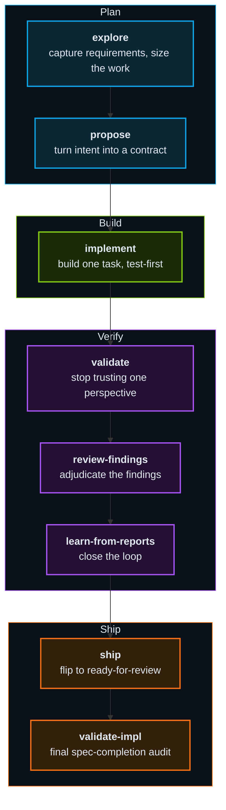
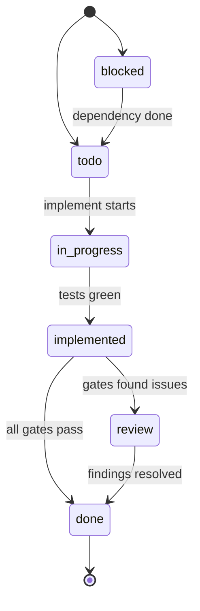
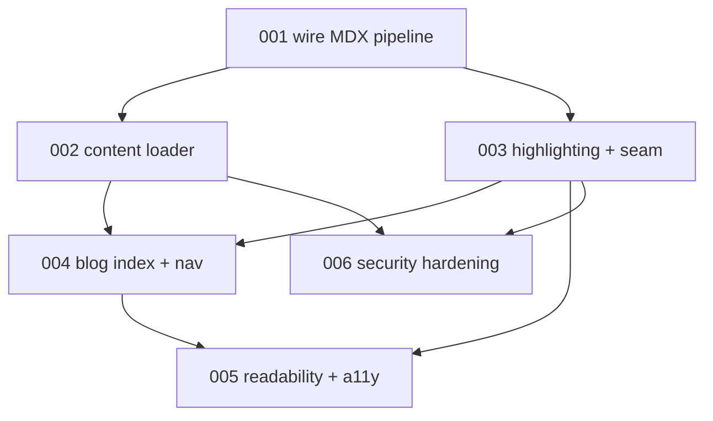
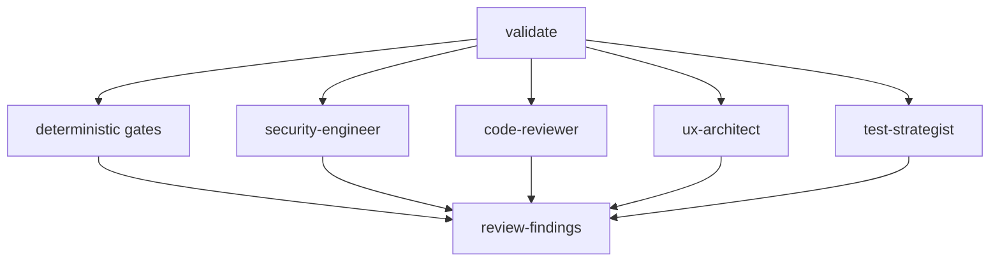

Most "AI writes your code" demos stop at the part that's hard: the second hour.
A model can draft a feature in one shot, but without rails it drifts — it forgets
the spec, skips the tests, and quietly ships the thing you didn't ask for. My bet
is the opposite of "trust the model more." It's: make everything *around* the
model deterministic — the spec, the gates, the order of operations — and keep the
model itself on a short leash.

This post walks the one flow I run for real feature work, end to end. It's a set
of slash commands and review agents that turn a loose intent into a reviewed,
shipped pull request. I'll go deep on what each phase is *for*, the state machine
the work moves through, and how a spec gets decomposed into tasks that build in
the right order.

## The Feature flow

For any work that earns a spec, the whole chain runs in a fixed order:
`explore → propose → implement → validate → review-findings →
learn-from-reports → ship → validate-impl`. Each phase is a command I run
explicitly. **Nothing auto-advances.** The workflow stops between phases so I
stay in the loop, and continuity lives on disk — every phase starts in a fresh,
isolated session and picks up the state the previous one left behind. No single
runaway context carries the whole feature from start to finish; each phase is
cheap, bounded, and resumable.

Each command owns exactly one responsibility. Here's what every phase is *for*:

### `explore` — capture requirements, size the work

- Runs a relentless "grill" interview to pin down intent
- Grounds it in the domain: updates `CONTEXT.md`, writes ADRs for hard-to-reverse, surprising calls
- Infers the **tier** and feature config once, up front
- Pulls specialist lenses — UX Researcher, Security Engineer, Software Architect
- Leaves an optional PRD. No code, no tasks yet

### `propose` — turn intent into a contract

- A Security Engineer writes a STRIDE threat model *before* any spec
- `spec.md` carries functional requirements, API contracts, a data model, BDD scenarios
- A Senior Project Manager decomposes the spec into the vertical-slice task DAG
- A Spec Reviewer audits consistency — and **hard-stops** on an incoherent spec

### `implement` — build one task, test-first

- Builds exactly one eligible task, on its own branch
- Red-green-refactor loop; a Test Strategist orders the backlog first
- Runs inline or routes to the implementer agent named in the task
- Drives the task `todo → in-progress → implemented`, opens a draft PR

### `validate` — stop trusting one perspective

- Runs the deterministic gates
- Fans out a parallel panel of advisory review agents (security, code, arch, test)
- Coverage audit: does the diff actually cover the task's acceptance criteria?
- Triple-gate rule — errored → re-run; findings → `review`; all clean → `done`

### `review-findings` — adjudicate the findings

- Mechanical ones (formatting, unused import, coverage gap) auto-fixed in the background
- The rest grouped by code region, presented for accept or reject
- A reasoned rejection can be promoted into a reusable KB rule on the spot
- Takes the task `review → done`

### `learn-from-reports` — close the loop

- Mines validation output for recurring findings and repeated rejections
- Promotes the patterns into KB rules, so the same mistake gets caught earlier next time

### `ship` — flip to ready-for-review

- Commits, pushes, flips the task's draft PR to ready
- PR targets the feature integration branch, not `main` — the feature accrues as a reviewable whole

### `validate-impl` — final spec-completion audit

- Runs once *every* task is `done`
- An Odium agent reads the cumulative diff against the spec's full FR list
- Asks the only end-question that matters: did we build the spec — no orphan code, no over-engineering, nothing missing?
- Clean verdict → ship; a reopen loops the gaps back as follow-up tasks until the verdict is `complete`

## The unit of work: tasks and their states

The thing that actually flows through that chain isn't "the feature" — it's a
**task**. A feature is decomposed into several tasks, and each task moves through
its own lifecycle independently. That lifecycle is an explicit state machine:

The states are deliberately few — `blocked`, `todo`, `in-progress`,
`implemented`, `review`, `done` — and each transition is owned by exactly one
phase, so the status of a task tells you precisely where it is:

- **`propose`** seeds every task as either `todo` (nothing in its way) or
  `blocked` (waiting on another task).
- **`implement`** flips a task `todo → in-progress` when it starts coding, then
  `in-progress → implemented` once the code is written and the tests are green.
- **`validate`** routes an `implemented` task one of two ways: `→ review` if any
  gate raised findings, or straight `→ done` if everything passed clean.
- **`review-findings`** closes the loop, taking a task `review → done` once I've
  adjudicated each finding.
- Finishing a task **unblocks its dependents** — every task that was `blocked` on
  it drops to `todo` and becomes eligible to start.

That last point is the important one: the state machine isn't decoration. A task
can't go `in-progress` while its dependencies are unfinished. The order is
enforced, not suggested.

## How a spec becomes tasks

The decomposition happens in `propose`, and it's where most of the leverage is.
A **Senior Project Manager** agent reads the spec and carves it into **vertical
slices** — each task is a tracer bullet that cuts through every layer it touches
(data, presentation, route, test) and is independently demoable. The rule the PM
works under is strict: a task has to justify *why it isn't merged with its
neighbor*. Slices get split only when one grows too large or could genuinely
deploy on its own — never just because two concerns feel conceptually separate.

Each task lands on disk as a numbered file (`001`, `002`, …) with
machine-readable frontmatter that makes it a contract, not a note:

- **`status`** — its place in the state machine above.
- **`blocked_by`** — the IDs of tasks that must finish first.
- **`implements`** — which functional requirements (`FR-3`, `FR-5`, …) and BDD
  scenarios from the spec this task is responsible for satisfying.
- **`implementer`** — which agent runs the task.
- **`estimated_files`** and **`test_cases`** — the file budget and the acceptance
  cases it has to turn green.

The `blocked_by` edges form a **DAG** — a buildable order with no cycles. Here's
the real shape from the spec for *this very blog*:

Task 001 wires the MDX pipeline and depends on nothing, so it starts first.
The loader and the syntax highlighting both build on that pipeline, so they're
`blocked_by` 001 — but not on each other, so they can run back to back without an
artificial ordering. The index page needs both, security hardening needs the
loader and the seam, and so on. The dependency graph *is* the build plan.

One more dial sits above all of this: the **tier**, inferred once in `explore`.
Tier sets the *artifact ceiling* — how much process the feature earns. A **small**
tier produces tasks only; **medium** adds a full `spec.md`; **large** adds a
`design.md` and a dedicated test strategy on top. The same machinery runs at every
tier — there's just less ceremony when the problem is already well understood.

## The agents review my code before I do

`validate` is worth zooming in on, because it's the phase where a single
perspective stops being enough. Beyond the deterministic gates, it dispatches a
panel of specialized review agents in parallel, each looking at the diff through
one lens. Their findings, plus the gate results, are what `review-findings` then
walks me through:

The point isn't that any one agent is right. It's that a security lens, a
code-quality lens, an architecture lens, and a test-coverage lens disagree in
useful ways — and I adjudicate the disagreement instead of grading my own
homework.

## The parts that don't bend

Four rules are enforced by the workflow itself, not left to per-run discretion:

- **Test-first is non-negotiable.** Red before green — a failing test has to exist
  before the implementing code. The core enforces the order; I can't talk it out
  of it on a tired afternoon.
- **Phases run in isolated sessions.** Each phase is cheap and bounded, with state
  handed off on disk. No single runaway context carries the whole feature.
- **Gates hard-block.** A failed gate stops the flow. There's no "assert and warn"
  escape hatch that lets a known failure slide through to `ship`.
- **The dependency graph is enforced.** A task can't start until the tasks it's
  `blocked_by` are `done`. The build order is a property of the system, not a thing
  I have to remember.

## Where this is going

Everything above is the version I run daily — a pile of bash and slash commands
wired to one AI runtime. It works, but it's married to a single tool. I'm
rebuilding it as a provider-neutral core so the *workflow* outlives any one model
or vendor. More on that rewrite soon.
