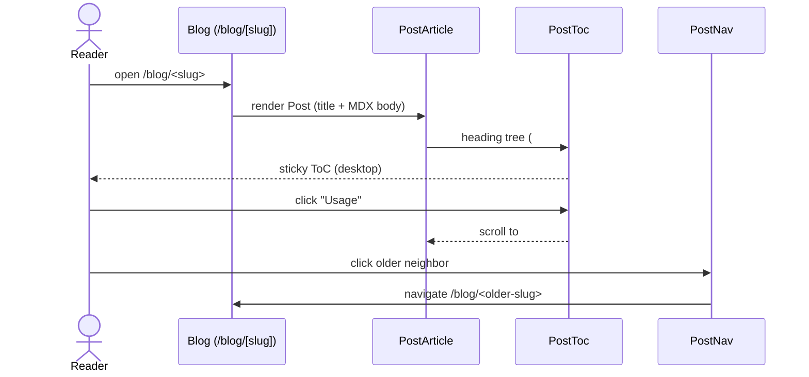

# Blog Readability — Specification

Feature: `blog-readability` · Tier: medium · Track: feature

## Overview

Improve readability and reader retention of the **Blog** (`/blog`, `/blog/[slug]`)
by adding four Docusaurus-proven, framework-agnostic capabilities to the existing
Next.js 16 (App Router, SSG) + React 19 + MUI 7 site — **without** migrating
frameworks and **without** relaxing the owner-authored MDX trust boundary
(ADR-0001, CLAUDE.md).

All work is additive presentation/data over **owner-authored Posts** or
output-only XML. No CMS, no database, no new external input, no new auth. The
seam pattern holds: types+data in `src/data/`, icon/color/JSX in a `*Presentation`
seam or `theme.ts` `brand` tokens, rendering in components.

The four capabilities:

1. **In-page Table of Contents** built from a Post's `##`/`###` headings.
2. **Heading anchors** — stable `id`s + hover-revealed deep-links.
3. **Prev/next Post navigation** derived from the already-ordered Post set.
4. **Typography pass** at the presentation seam, plus an **RSS feed** emitted at build.

## Resolved Decisions (grilling, 2026-07-02)

Decisions taken in a readability-focused grilling pass, grounded in typography
research (line length 45–75 CPL, sweet spot ~66; body ≥16px, 18–20px better for
long-form; line-height 1.5–1.7 — Baymard, UXPin; and the serif-vs-sans reading
literature: Lund 1999 / Poole review / Ergonomics — **no reliable screen
readability advantage for serif**, so typeface class is a weak lever).

1. **Typeface — locked to Geist Sans.** No font-family swap in this slice. The
   evidence does not support serif as more readable on screen, and typeface class
   is a weaker lever than measure/size/line-height/contrast. A serif/aesthetic
   re-typeface, if ever wanted, is a separate identity decision (future ADR), not
   FR-4. `layout.tsx` is not touched.
2. **Measure → `64ch` (from `68ch`), promoted to a theme token.** The `ch` unit is
   the width of `0`, so a column measured in `ch` renders ~1.1–1.2× more real
   characters; `68ch` rendered ≈ 75–82 CPL (at/above the comfort ceiling). `64ch`
   lands real CPL ≈ 66–72. The value moves from the raw `"68ch"` literal in
   `PostArticle` to a named token (in `theme.ts`), so prose/ToC layout share one
   source of truth. The `PostArticle` doc comment that says "~68ch" is updated.
3. **Body size / line-height → 18px (`1.125rem`) / `1.7`,** set once in
   `proseTextSx` (not per component). Tighter leading pairs better with the
   narrower `64ch` measure than the current `1.75`.
4. **Contrast — body left as-is.** `slateLight #e2e8f0` on `backgroundDefault
   #0a1118` ≈ 15:1 (exceeds AAA); changing it is pure churn. FR-4's contrast work
   is scoped to **only** sanity-checking the muted `slate #64748b` where it carries
   readable text (≈3.5:1, under AA); nudge lighter if it fails, defer if it is
   syntax-comment-only.
5. **Mobile ToC — no section nav; a thin, non-interactive top reading-progress
   bar is the only mobile reading affordance.** No collapsible/disclosure ToC,
   no link list. A ~34-char mobile measure has no room for a section nav; the
   bar (`ScrollProgressBar`, driven by `useScrollProgress`) reflects whole-
   document scroll % so a mobile reader still has a lightweight sense of
   progress. Confirms `toc-hidden-mobile` as a hard hide of the nav, now paired
   with `toc-progress-mobile`.
6. **Desktop ToC layout — left sticky dot-rail in its own `md:flex-row`
   column** (`max-w-content` split, `Author.tsx`/`IdentityRail.tsx` precedent —
   not a leftover-margin gutter). Each chapter name stays hidden until its dot
   is hovered, keyboard-focused, or is the scroll-spy-active section
   (`aria-current="location"`). Prose stays `min-w-0 flex-1`, never below the
   `64ch` measure; because the rail is now a real column rather than a margin
   gutter, prose shifts right-of-center (accepted trade-off — the alternative,
   a fixed/overlaying rail, collides with prose at md–xl widths). **No** desktop
   progress bar — the bar is mobile-only.
7. **ToC scroll-spy — yes, cheap.** Active-heading highlight via
   `IntersectionObserver` (no scroll listener), surfaced as `aria-current=
   "location"` on the active link with its label reveal also triggered on
   `focus-visible` (keyboard parity with hover). Anchor jumps stay instant (no
   smooth-scroll); honor `usePrefersReducedMotion`. The mobile progress bar
   reuses the same organism's `useScrollProgress` hook — one client organism
   (`ArticleToc`) owns both behaviors so `reducedMotion` is read once, not
   per-child.
8. **Heading anchor (FR-2) — plain `<a href="#id">`.** No clipboard/toast; the URL
   updates on click and the reader copies from the address bar. Keeps the heading
   seam free of interaction JS.
9. **Prev/next (FR-3) — title + "Newer post" / "Older post" caption** with a
   directional arrow (← newer, older →). No dek. Side-by-side on desktop, **stacked
   on mobile**. "Newer/Older" (not "Previous/Next") since adjacency is date order.
10. **RSS domain (FR-6) — build-time `SITE_URL` env,** validated once with
    `new URL(...)` in a single config module (`src/data/siteConfig.ts`), fail-fast
    on missing/empty/malformed. **Not** `NEXT_PUBLIC_` — the feed is built server-
    side and the domain never needs to reach the client bundle.

## Functional Requirements

### FR-1: In-page Table of Contents
A reader of a Post sees a Table of Contents auto-generated from that Post's `##`
and `###` headings, each entry linking to the corresponding section. On desktop
the ToC is a sticky left dot-rail beside the prose column, with section names
revealed on hover/focus/active; on mobile the rail is not rendered at all and a
thin, non-interactive top reading-progress bar is the only mobile reading
affordance, so the prose column never crowds the 64ch measure. The ToC reflects
the exact heading tree of the rendered Post — no hand-maintained list.

**Data:** heading tree derived at build from the Post body
**Scenarios:** toc-renders-from-headings, toc-sticky-desktop, toc-hidden-mobile,
toc-scrollspy-active, toc-progress-mobile

### FR-2: Heading anchors and deep-linking
Every `##`/`###` heading in a Post body carries a stable, slug-derived `id`, and
exposes a hover-revealed anchor link so a reader can copy a URL that deep-links
directly to that section. Navigating to `/blog/<slug>#<heading-id>` scrolls the
matching heading into view. Heading `id`s are added by `rehype-slug` in the
build-time MDX pipeline and flow to the DOM through the existing single heading
presentation seam — no second render path is introduced.

**Scenarios:** anchor-deep-link-resolves, heading-id-stable, sec-toc-single-render-seam

### FR-3: Prev/next Post navigation
At the foot of a Post, a reader sees links to the adjacent Posts in the Blog's
canonical order. Adjacency is derived from the already-ordered, already-validated
Post set (`getPosts()` → `buildPostSet`, ordered newest-first by date). The
newest Post has no "newer" neighbor and the oldest has no "older" neighbor; those
slots render nothing rather than a dead link.

**Scenarios:** prevnext-middle-post, prevnext-boundary-post, sec-prevnext-single-slug-gate

### FR-4: Typography and readability pass
Long-form Post prose is refined at the presentation seam — measure, font size,
heading rhythm, vertical spacing, contrast, and code-block readability — driven
only by `brand` tokens in `theme.ts` and the `*Presentation` seams. No hex or JSX
is added to data modules, and the single-brand-color-seam invariant is preserved.

**Scenarios:** typography-measure-constrained, typography-tokens-only

### FR-5: RSS feed
The site emits a valid RSS/XML feed at `/feed.xml`, generated at build from
`getPosts()`, with one entry per published Post carrying its title, description
(dek), absolute URL, and publication date. Every interpolated field is XML-escaped
at the single serialization point. The feed is output-only: it consumes no request
body or query params and exposes no backend.

**Contracts:** EP-FEED-GET
**Scenarios:** feed-valid-xml, feed-entry-per-post, feed-absolute-urls, sec-rss-xml-escape, sec-feed-no-error-leak

### FR-6: Site-domain build config
The absolute URLs required by the RSS feed (FR-5) are built from a **site domain**
sourced from build-time env/config, never hardcoded. A missing, empty, or
malformed domain fails the build fast rather than silently shipping broken or
localhost URLs to feed consumers.

**Scenarios:** sec-feed-domain-config-fail-fast

## API Contracts

### EP-FEED-GET — GET /feed.xml
**Auth:** none (public, static output)
**FRs:** FR-5, FR-6

Route handler (`src/app/feed.xml/route.ts`) rendered statically at build; consumes
no request input. Body is an RSS 2.0 XML document.

| Status | When | Body |
|--------|------|------|
| 200 | feed generated | `application/rss+xml` — `<rss>` with one `<item>` per Post `{ title, description, link, pubDate, guid }`, all fields XML-escaped |
| build fail | site-domain env missing/empty/malformed | build aborts with a developer-facing error; no client-facing output emitted (FR-6) |

## Scenarios

### toc-renders-from-headings
```gherkin
Given a Post whose body has "## Setup", "### Install", and "## Usage"
When the reader opens /blog/<slug> on desktop
Then a Table of Contents lists "Setup", "Install", "Usage" in document order
And each entry links to that heading's id (#setup, #install, #usage)
And the "Install" entry is visually nested under "Setup"
```

### toc-sticky-desktop
```gherkin
Given a Post detail page rendered at a desktop breakpoint (>=1280)
When the reader scrolls the prose
Then the Table of Contents dot-rail remains visible (position: sticky) in its
  own left column
And the prose column stays within the 64ch measure
```

### toc-hidden-mobile
```gherkin
Given a Post detail page rendered at a mobile breakpoint (375)
When the page loads
Then the ToC nav (aria-label "Table of contents") is not rendered/visible
And the top reading-progress bar is the only ToC-adjacent affordance present
And the prose column occupies the full width without the rail crowding it
```

### toc-scrollspy-active
```gherkin
Given a Post detail page rendered at a desktop breakpoint
When the reader scrolls a mid-article heading into view
Then that heading's ToC link carries aria-current="location"
And its label is revealed (no hover/focus required while active)
```

### toc-progress-mobile
```gherkin
Given a Post detail page rendered at a mobile breakpoint
When the reader scrolls the article
Then the top reading-progress bar (role="progressbar") reflects the
  document's scroll percentage
And the bar is hidden at desktop breakpoints
```

### anchor-deep-link-resolves
```gherkin
Given a Post with a "## Usage" heading assigned id "usage"
When the reader navigates to /blog/<slug>#usage
Then the "Usage" heading scrolls into view
And hovering the heading reveals an anchor link whose href is "#usage"
```

### heading-id-stable
```gherkin
Given a Post heading "## Getting Started"
When the page is built
Then the heading element carries a deterministic id "getting-started"
And rebuilding the unchanged Post yields the same id
```

### prevnext-middle-post
```gherkin
Given three Posts ordered newest-first [A, B, C]
When the reader opens Post B
Then the foot shows a link to A (newer neighbor) and a link to C (older neighbor)
And each link points to that neighbor's /blog/<slug>
```

### prevnext-boundary-post
```gherkin
Given Posts ordered newest-first [A, B, C]
When the reader opens the newest Post A
Then no "newer" link renders (no dead link)
And a link to B renders as the older neighbor
And symmetrically the oldest Post C shows only a newer link
```

### typography-measure-constrained
```gherkin
Given a Post detail page
When the prose renders
Then body text is held to a constrained measure for readable line length
And heading sizes, spacing, and contrast follow the refined scale
```

### typography-tokens-only
```gherkin
Given the typography pass changes
When the presentation seams and theme are inspected
Then every color resolves from a brand token in theme.ts
And no raw hex or JSX has been added to any src/data/ module
```

### feed-valid-xml
```gherkin
Given the site is built
When a client requests /feed.xml
Then the response is well-formed RSS 2.0 XML with content-type application/rss+xml
And it parses without error in a standard RSS reader
```

### feed-entry-per-post
```gherkin
Given the Blog has published Posts P1..Pn from getPosts()
When /feed.xml is generated
Then it contains exactly one <item> per Post
And each item carries title, description (dek), link, and pubDate
```

### feed-absolute-urls
```gherkin
Given the site-domain config is set to https://example.com
When /feed.xml is generated
Then every <item> link is an absolute URL rooted at https://example.com/blog/<slug>
And no relative or localhost URL appears in the feed
```

## Security Scenarios

### sec-rss-xml-escape
```gherkin
Given an owner-authored Post whose title or dek contains "&", "<", ">", or quotes
When /feed.xml is serialized
Then those characters are XML-escaped at the single serialization point
And the feed remains well-formed (no field escapes its element)
```
_Threat: Tampering (MEDIUM) — RSS XML is an output boundary; escape even trusted source. (`security/input-validation.md`)_

### sec-feed-domain-config-fail-fast
```gherkin
Given the site-domain env var is missing, empty, or not a valid URL
When the site is built
Then the build fails fast with a developer-facing error
And no feed with placeholder/localhost absolute URLs is emitted to production
```
_Threat: Information disclosure (MEDIUM) — config from env, fail fast. (`security/secrets.md`)_

### sec-feed-no-error-leak
```gherkin
Given RSS generation throws (e.g. an authoring bug in a Post)
When the failure surfaces
Then internal stack traces, filesystem paths, and exception text stay in build logs only
And no internal error detail is emitted into client-facing output
```
_Threat: Information disclosure (LOW) — never expose internal error detail. (`security/secrets.md`)_

### sec-toc-single-render-seam
```gherkin
Given the ToC/anchor feature adds heading ids and anchor links
When heading text is rendered
Then it flows through the existing single MDX presentation seam (mdxPresentation.tsx)
And no second rehype/unified render path bypassing <script>/<iframe> neutralization is introduced
```
_Threat: Elevation of privilege (HIGH if violated) — one render seam; owner-authored trust unchanged. (`security/authz.md`)_

### sec-prevnext-single-slug-gate
```gherkin
Given prev/next navigation needs adjacent Post slugs
When adjacency is derived
Then it reuses buildPostSet's already-validated ordered set
And it does not re-derive or re-validate slugs in a parallel gate
```
_Threat: Elevation of privilege (LOW) — single slug-validation gate. (`security/authz.md`)_

### sec-dep-hygiene
```gherkin
Given rehype-slug (and any TOC-extraction plugin) is added
When the dependency lands
Then it is pinned in package-lock.json from the official registry
And it runs only in the build-time MDX pipeline, never against runtime request input
```
_Threat: Tampering / supply chain (LOW) — dependency hygiene. (`security/deps-and-config.md`)_

## User Flow

Primary happy path: a reader opens a Post, uses the ToC to jump to a section, then
follows prev/next to an adjacent Post. (`sequenceDiagram`, advisory.)


