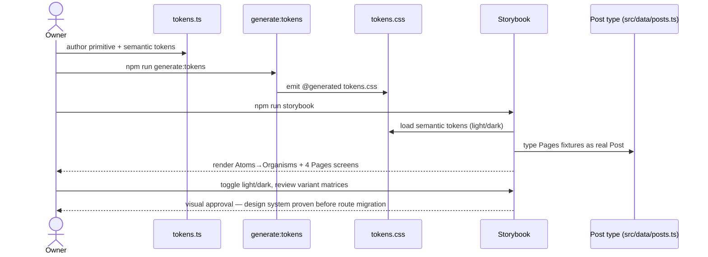

# Spec — `design-system`

## Overview

First pack of a phased **MUI 7 → shadcn/ui** re-platform for the portfolio
(Next.js 16 App Router, SSG; React 19). This pack stands up a **shadcn/ui +
Storybook component workshop** that adopts the Figma "The Blog" blog-template
visual language (light; primary `#7F56D9`; Inter), **built in isolation** —
the live app routes (`/`, `/projects`, `/blog`, `/blog/[slug]`) stay on MUI this
pack and migrate route-by-route in later packs.

The value: a token-driven, framework-agnostic component library documented in a
**Storybook** visual-review surface, de-risking the full migration by proving
the design system before it touches any live route. The organizing invariant is
a **two-layer token seam** (`src/theme/tokens.ts` → `@generated tokens.css`) that
components reference only through semantic aliases — the shadcn analogue of the
existing `brand` color seam.

This is a **styling/tooling** slice: it introduces **no runtime request
handling, no CMS, no database, no auth, and no external input**. The MDX trust
boundary (ADR-0001, project CLAUDE.md) is explicitly **unchanged** (decision
D-7). The single new exposure surface is **Storybook**, which stays dev-only and
out of the shipped SSG output.

Decisions D-1…D-7 from `prd.md` are the authoritative scope record; ADR
candidates flagged there are resolved in `design.md`. This spec has **no API
Contracts and no Data Model** sections — the pack changes no endpoints and no
persistent schema (the token "model" is a build-time TS artifact, covered by
FR-2, not a database table).

## Functional Requirements

### FR-1: MUI ↔ Tailwind coexistence tooling

Tailwind v4 is wired into the Next 16 build via `@tailwindcss/postcss` with
**preflight disabled**, and `next-themes` is installed with the `class`
strategy. Both styling runtimes load without MUI's `CssBaseline` losing
authority: MUI Emotion styles win cascade ties during coexistence
(`StyledEngineProvider injectFirst`). The existing app renders byte-for-byte
unchanged after the tooling lands.

**Scenarios:** tooling-coexists-no-regression, preflight-disabled-baseline-intact

### FR-2: Two-layer token system, TS-authored and CSS-generated

`src/theme/tokens.ts` is the single source of truth for design tokens, modelled
in two layers: a **primitive** palette (raw Figma hues) and **semantic**
shadcn-role aliases (`--primary`, `--foreground`, …) that map onto primitives. A
`generate:tokens` script emits an `@generated tokens.css` from `tokens.ts`; the
generated file is never hand-edited. Regenerating from unchanged input produces
identical output (deterministic codegen).

**Scenarios:** tokens-codegen-deterministic, tokens-two-layer-shape,
generated-css-not-hand-edited

### FR-3: Components reference only the semantic token layer

Every component — restyled shadcn primitive or bespoke composition — resolves
color/spacing through the **semantic** layer only. No component contains a raw
hex literal, a `--brand-*` primitive reference, or a `palette.*` lookup. This
purity rule is enforced mechanically by a lint rule (`no-direct-palette-import`,
JS-language GritQL/lint plugin), so a violation fails `npm run lint`.

**Scenarios:** component-uses-semantic-only, raw-hex-in-component-fails-lint

### FR-4: shadcn primitives reused and restyled to the Figma look

The shadcn primitives `badge`, `button`, `input`, `navigation-menu` (+ `sheet`),
`card`, and `avatar` are installed via `shadcn init`/`add` and restyled to the
Figma template's light visual language through the semantic token layer — not
re-implemented from scratch and not left at stock shadcn defaults.

**Scenarios:** shadcn-primitives-installed, primitives-restyled-to-figma

### FR-5: Bespoke Figma composition components

The Figma-specific compositions with no shadcn primitive equivalent are built as
components: post cards, newsletter, footer, page-info, article/prose layer,
author-info, conclusion, ads-space, and post-layout. Each composes atoms/shadcn
primitives and binds only to the semantic token layer.

**Scenarios:** bespoke-compositions-exist, compositions-compose-primitives

### FR-6: Badge categories as an exhaustive CVA variant map

Badge category styling is a closed taxonomy expressed as a `class-variance-
authority` variant map — the shadcn analogue of the exhaustive
`Record<IconKey, …>` in `skillPresentation`. All 8 decorative hues (violet,
blue/indigo, pink/magenta, sky, green, gray-blue, orange, rose/red — none tied
to category name) are defined. Adding a category the map does not cover is a
**compile error**, never a silent runtime fallback.

**Scenarios:** badge-category-exhaustive, badge-missing-category-compile-error

### FR-7: Storybook workshop, atomic-design organization

Storybook 9 runs as the visual-review surface with an atomic-design sidebar
(`Atoms/`, `Molecules/`, `Organisms/`, `Pages/`). Atoms get exhaustive
variant/state matrices plus a Playground; molecules and organisms get
representative-content stories. Storybook boots against Next 16 (adapter
verified — see design.md spike).

**Scenarios:** storybook-boots, atoms-have-exhaustive-matrices,
sidebar-atomic-design-order

### FR-8: Four composed Pages stories bound to the real `Post` type

Four `Pages/` stories — Home, Blog Listing, Single Post, Author — are composed
from real organisms and use the **actual `Post` type from `src/data/posts.ts`**
(the module `postLoader.ts` itself imports it from) as
fixtures, not invented props. Each page-composing component accepts the real
`Post` shape; a divergence from that type is a compile error (the pack's
cheap-insurance guardrail against pack-2 rework).

**Scenarios:** pages-stories-render, pages-use-real-post-type,
invented-post-prop-rejected

### FR-9: Light + dark theming on the semantic layer

Both `light` and `dark` themes ship now. Light = Figma light-frame tokens; dark
= the real Figma dark-mode frame (node `614:679` — bg `#090d1f`, headings
white, body `#c0c5d0`) mapped onto the **same** semantic aliases. Because
components bind only to semantic tokens, adding dark is a single `.dark {}`
token block — no per-component change. `next-themes` `class` strategy toggles
the active theme.

**Scenarios:** theme-toggles-light-dark, dark-is-single-token-block

### FR-10: Storybook excluded from production output (security)

Storybook is a **dev-only** surface. Its build artifacts, stories, and fixtures
are never emitted into the shipped Next SSG production bundle. A production build
contains no Storybook runtime, no `*.stories.*` modules, and no
`storybook-static/` output under the deployed tree.

**Scenarios:** prod-build-excludes-storybook, stories-not-in-ssg-output

### FR-11: MDX trust boundary preserved unchanged

This styling migration does **not** touch the MDX trust seam. The single
slug-validation gate (`buildPostSet`, `^[a-z0-9-]+$`) and the MDX hardening seam
(`mdxPresentation.tsx` — external-link `rel`, `<script>`/`<iframe>`
neutralizers) are byte-unchanged. The "owner-authored MDX only" rule is not
relaxed; no `rehype-sanitize`/CSP obligation is triggered because no untrusted
MDX path is introduced.

**Scenarios:** mdx-trust-seam-unchanged, owner-authored-rule-not-relaxed

### FR-12: Mobile breakpoint matches the Figma "iPhone 15" frame

The Figma file's mobile frame (node `614:353`, its own light/dark toggle) is
the responsive-breakpoint reference. Components that reflow at mobile widths
match this frame's layout, not an ad-hoc guess.

**Scenarios:** mobile-breakpoint-matches-figma-frame

## Scenarios

### tooling-coexists-no-regression
```
Given the app renders on MUI 7 + Emotion before the change
When Tailwind v4 (@tailwindcss/postcss) and next-themes are added with preflight disabled
Then `npm run build` succeeds and every existing route renders visually unchanged
And the e2e suite (chromium) passes with no new failures
```

### preflight-disabled-baseline-intact
```
Given Tailwind's preflight reset is disabled in the PostCSS config
When a page mounts both MUI CssBaseline and the Tailwind layer
Then MUI CssBaseline remains authoritative for base element styles
And StyledEngineProvider injectFirst keeps Emotion styles winning cascade ties
```

### tokens-codegen-deterministic
```
Given `src/theme/tokens.ts` is unchanged
When `npm run generate:tokens` runs twice
Then both runs emit byte-identical `tokens.css`
And the file carries an `@generated` banner marking it machine-authored
```

### tokens-two-layer-shape
```
Given the token source authored in TypeScript
When the tokens are inspected
Then a primitive palette layer (raw Figma hues) and a semantic alias layer exist as distinct maps
And every semantic alias resolves to a primitive, never to a raw inline hex
```

### generated-css-not-hand-edited
```
Given the `@generated tokens.css` file
When a developer edits it by hand and runs `generate:tokens`
Then the codegen overwrites the manual edit
And the source of any token change is `tokens.ts`, never the CSS
```

### component-uses-semantic-only
```
Given a restyled shadcn primitive or bespoke composition
When its styles are authored
Then color/spacing reference only semantic aliases (e.g. `--primary`, `--foreground`)
And no `--brand-*` primitive or `palette.*` lookup appears in the component
```

### raw-hex-in-component-fails-lint
```
Given the `no-direct-palette-import` lint rule is active
When a component introduces a raw hex literal or a primitive-layer import
Then `npm run lint` fails and names the offending file
```

### shadcn-primitives-installed
```
Given a fresh `shadcn init`
When the primitive set (badge, button, input, navigation-menu, sheet, card, avatar) is added
Then each primitive's source lands in the components tree and imports the semantic tokens
```

### primitives-restyled-to-figma
```
Given the stock shadcn primitives
When they are restyled to the Figma template
Then their rendered appearance matches the Figma light look (primary #7F56D9, Inter)
And no stock shadcn default color remains hardcoded in the primitive
```

### bespoke-compositions-exist
```
Given the Figma design's non-primitive elements
When the bespoke set is built
Then post cards, newsletter, footer, page-info, article/prose, author-info, conclusion, ads-space, and post-layout each exist as components
```

### compositions-compose-primitives
```
Given a bespoke composition (e.g. a post card)
When it is implemented
Then it composes atoms/shadcn primitives rather than re-implementing them
And binds only to the semantic token layer
```

### badge-category-exhaustive
```
Given the Badge CVA variant map
When the category taxonomy is defined
Then every one of the 8 category hues has a variant entry
```

### badge-missing-category-compile-error
```
Given the Badge CVA variant map typed as a closed union
When a new category is referenced without a matching variant entry
Then TypeScript raises a compile error rather than falling back at runtime
```

### storybook-boots
```
Given Storybook 9 configured for Next 16
When `npm run storybook` starts
Then the workshop boots and renders the component sidebar without adapter errors
```

### atoms-have-exhaustive-matrices
```
Given an atom (e.g. Button, Badge)
When its stories are authored
Then every variant/state combination has a named story plus a Playground story
```

### sidebar-atomic-design-order
```
Given the Storybook sidebar
When stories are titled
Then they group under Atoms/, Molecules/, Organisms/, Pages/ by atomic-design title paths
```

### pages-stories-render
```
Given the four Pages stories (Home, Blog Listing, Single Post, Author)
When Storybook renders them
Then each composes real organisms into a full screen
```

### pages-use-real-post-type
```
Given the Pages stories need Post data
When their fixtures are authored
Then the fixtures are typed as the actual `Post` from `src/data/posts.ts` (slug, title, dek, date, readingTimeMinutes, formattedDate, published)
And not as invented ad-hoc props
```

### invented-post-prop-rejected
```
Given a page-composing component that accepts a Post
When a fixture omits or renames a real `Post` field
Then TypeScript raises a compile error
```

### theme-toggles-light-dark
```
Given next-themes with the class strategy registering light and dark
When the active theme toggles
Then the `.dark` class swaps the semantic token values and components re-render in the new theme
```

### dark-is-single-token-block
```
Given components bind only to semantic aliases
When dark theme is added
Then the entire dark palette is expressed as one `.dark {}` token block
And no component requires a per-theme code change
```

### mobile-breakpoint-matches-figma-frame
```
Given the Figma "iPhone 15" mobile frame (node 614:353) with its own light/dark toggle
When a component or Pages story reflows at mobile viewport width
Then its layout matches the mobile frame, not an ad-hoc/approximated breakpoint
```

### prod-build-excludes-storybook
```
Given a production `npm run build`
When the SSG output is generated
Then it contains no Storybook runtime and no storybook-static/ under the deployed tree
```

### stories-not-in-ssg-output
```
Given `*.stories.*` modules live beside components
When the production bundle is emitted
Then no story module or fixture is included in a shipped route chunk
```

### mdx-trust-seam-unchanged
```
Given the MDX trust seam (buildPostSet slug gate + mdxPresentation hardening)
When the styling migration lands
Then buildPostSet and mdxPresentation.tsx are byte-unchanged
And no new MDX ingestion path is introduced
```

### owner-authored-rule-not-relaxed
```
Given decision D-7 (MDX trust boundary unchanged)
When the pack ships
Then the owner-authored-only rule still holds and no rehype-sanitize/CSP obligation is triggered
```

## Security Scenarios

STRIDE surface is narrow: this pack adds **no runtime input, no auth, no
persistence** — Spoofing, Repudiation, and runtime DoS are N/A. The live threats
are **Information Disclosure** (Storybook leaking into prod), **Elevation of
Privilege** (silent MDX-trust downgrade), and **Tampering** (supply-chain via
new dev-deps + codegen path safety).

### sec-storybook-excluded-from-prod (Information Disclosure — High)
```
Given Storybook 9 is installed with a dev-server config
When the production `npm run build` output is generated
Then no Storybook output (storybook-static/ or story chunks) is present in the deployed SSG artifact
And the authoritative pre-push gate (`.husky/pre-push` — GitHub Actions is deploy-only, runs no checks) fails the push if any Storybook output is found in the build tree, asserted by a `src/security/` vitest test in the repo's supply-chain-gate pattern
```

### sec-mdx-seam-untouched (Elevation of Privilege — Critical if triggered)
```
Given src/utils/mdxPresentation.tsx and src/data/postLoader.ts are the sole MDX hardening + slug-validation seam
When any component in this pack is added or restyled
Then neither file is modified in this pack
And any component rendering Post content consumes only the already-hardened seam output, never re-parsing raw MDX/HTML
```

### sec-no-second-mdx-render-path (Elevation of Privilege)
```
Given a restyled article/prose component or a Storybook story that displays Post body content
When it is implemented
Then it does not introduce a second rendering path that bypasses the script/iframe neutralizers or drops rel="noopener noreferrer"
And no rehype-sanitize/CSP obligation is triggered because no untrusted-MDX path is added
```

### sec-deps-pinned-and-locked (Tampering / supply-chain — Medium)
```
Given new dependencies enter the tree (Tailwind v4, @tailwindcss/postcss, Storybook 9 + addons, Radix, next-themes, class-variance-authority, shadcn-generated source)
When they are introduced
Then package-lock.json is committed, new versions are pinned (not loose caret ranges) on first introduction
And shadcn-generated component source is reviewed as first-party code in the PR diff
```

### sec-codegen-path-safety (Tampering — Low, standing invariant)
```
Given the generate:tokens script writes tokens.css from tokens.ts
When the script runs
Then its output path is a hardcoded literal — never derived from env vars, CLI args, or external input
And the script fails fast if the resolved path is outside src/theme/
```

### sec-no-secrets-in-tokens-or-fixtures (Information Disclosure — Low)
```
Given tokens.ts, Storybook fixtures, and .storybook/ config are authored
When they are committed
Then no .env value, API key, credential, or non-public data is referenced in them
And fixtures reuse only the already-public Post type
```

## User Flow

The primary journey is the **owner reviewing the new component system in
Storybook** before any live route migrates. Participants are all terms defined
above (Owner, Storybook, tokens.ts / tokens.css token seam, Post type).


