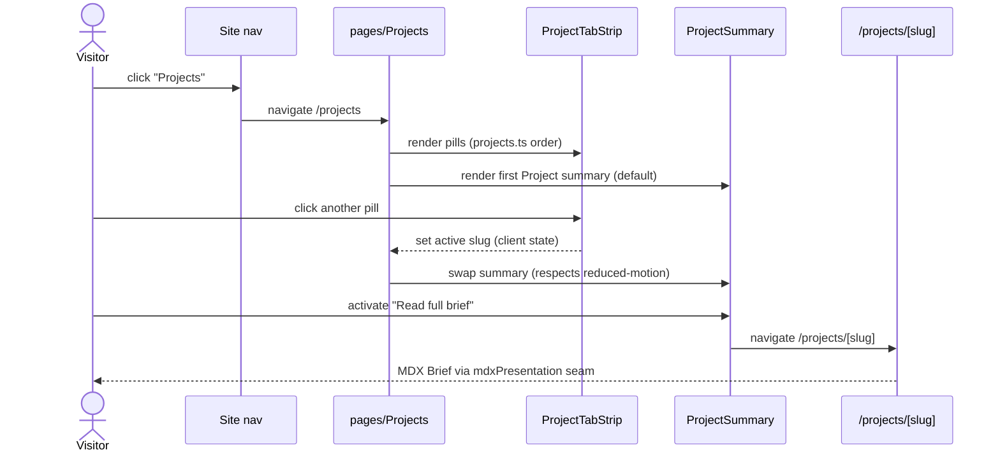

# Spec — Projects tab

_Feature: `projects-tab` · tier: medium · track: feature_

## Overview

The site has no home for the owner's **Projects**; `/projects` is a 404 today. This
feature adds a real `/projects` section that presents each **Project** as a scannable
**Project summary** (an index card), with a per-Project **Project Brief** MDX page at
`/projects/[slug]` for depth-on-demand. It targets recruiters doing a fast credibility
scan (who judge largely from the summary) and technical peers who want the deep read.

The build follows the repo **seam pattern**: typed, JSX-free domain data in
`src/data/projects.ts`; all icon/color/label resolution in a `src/utils/projectPresentation.tsx`
seam; Storybook-first components (`ui/` atoms, `ds/` organisms) composed by a
`pages/Projects` screen. The Brief detail route reuses the **existing** blog MDX
pipeline and `mdxPresentation.tsx` seam — no second render path (ADR-0001, ADR-0002).

Static SSG only: no CMS, no DB, no external input, no API. `src/data/projects.ts` is the
authoritative slug set and the single slug-validation gate (`^[a-z0-9-]+$`), mirroring the
blog's boundary; the MDX trust boundary extends unchanged to Briefs.

Glossary terms used exactly per `CONTEXT.md`: **Project**, **Project summary** (index card),
**Project Brief** (MDX page), **MVP Progress**, **Status**, **Tech stack**, **Post**.

## Functional Requirements

### FR-1: Project data model as authoritative slug set
`src/data/projects.ts` defines a typed, JSX-free `Project` record (title, slug, tagline,
`status`, `mvpProgress` 0–100, `currentState`, `techStack`, `relatedPosts`) and an
owner-curated, manually-ordered array. This array is the single source of truth for the
Project concept and the authoritative slug set consumed by every downstream layer —
mirroring `domains.ts`. No hex, no icons, no JSX in this module.

**Data:** `Project`
**Scenarios:** first-pill-default, exploring-muted-tone

### FR-2: Single slug-validation gate
Every candidate slug in `projects.ts` is validated against `^[a-z0-9-]+$` in exactly one
place (a pure core, mirroring the blog's `buildPostSet`). An invalid slug is skipped with a
build warning and never reaches a filesystem join; the validated set is the only slug source
`generateStaticParams` maps. The regex is identical to the blog's — no drift.

**Data:** `Project`
**Scenarios:** invalid-slug-skipped, slug-traversal-blocked

### FR-3: Presentation seam resolves status and tech
`src/utils/projectPresentation.tsx` maps `Status` → `{ tone, label, dot }` and `TechKey` →
`BadgeCategory` via exhaustive `Record`s (a missing entry is a compile error, like
`categoryPresentation`). `Exploring` and low-MVP-Progress Projects resolve to a `muted` tone
here — de-emphasis is a seam rule, not a component branch. Components consume seam output and
never reach the Badge registry or a status color directly.

**Data:** `Project`, `TechKey`
**Scenarios:** exploring-muted-tone

### FR-4: `/projects` index route and nav integration
A real `/projects` route renders `pages/Projects`: a sticky, one-row, horizontally
scroll-snapping **pill strip** (one pill per Project, ordered by the `projects.ts` array) above
a full-width **Project summary**. The first pill is selected on initial render (before any
scroll). Clicking a pill swaps the summary client-side (no navigation); the summary carries a
"Read full brief" link to `/projects/[slug]`. `/projects` is added to `navItems`.

**Scenarios:** nav-to-projects, pill-switch-summary, first-pill-default, read-full-brief-link

### FR-5: Accessible tablist
The pill strip is a proper ARIA `tablist`: roving `tabIndex`, arrow-key / Home / End
navigation, correct `aria-selected`, and focus management on the active tab. It remains usable
at 200% zoom (one-row scroll-snap rail, peek/fade affordance so off-screen pills are
discoverable), and the client-side summary swap respects `prefers-reduced-motion`.

**Scenarios:** keyboard-tablist-nav, zoom-200-tablist, reduced-motion-swap

### FR-6: `ui/` atoms and meter dimension tokens
Three Storybook-first `ui/` atoms: `status-dot`, `tab-pill` (a dumb, presentational tab —
no tablist/keyboard logic), and `meter`. `ui/meter` adds exactly two new semantic dimension
tokens to `tokens.ts` (regenerate `tokens.css` via `npm run generate:tokens`; the freshness
test must pass). Each atom ships a sibling `*.stories.tsx` covering its meaningful states in
both themes before any route import.

**Scenarios:** meter-legend-label

### FR-7: `ds/` organisms
Two Storybook-first `ds/` organisms: `ProjectTabStrip` (owns `role="tablist"`, roving-tabIndex
keyboard nav, sticky one-row scroll-snap rail with peek/fade) composed from `tab-pill` +
`status-dot` atoms; and `ProjectSummary` (renders one Project's summary card from seam output
only — title, tagline, Status, MVP-Progress meter, current state, Tech-stack badges, related-Post
links, "Read full brief" link). `pages/Projects` composes both and lifts active-slug state.

**Scenarios:** pill-switch-summary, exploring-muted-tone

### FR-8: `/projects/[slug]` Brief detail route
`/projects/[slug]` mirrors `src/app/blog/[slug]/page.tsx`: it dynamic-imports
`content/projects/${slug}.mdx`, renders the body through the **existing** `mdxPresentation.tsx`
seam (no new body-element map), sets `dynamicParams = false`, and its `generateStaticParams`
maps only the already-validated `projects.ts` slug set (never globs `content/projects/`). A new
`content/projects/` directory holds Brief bodies. `generateMetadata` sets the per-Brief `<title>`.

**Data:** `Project`
**Scenarios:** brief-renders-mdx, enumerate-not-glob, mdx-script-neutralized, external-link-hardened

### FR-9: Missing-Brief and orphan handling
A Project in `projects.ts` whose `content/projects/[slug].mdx` body is absent produces a
build-time warning (not a hard failure): no `/projects/[slug]` route is generated for it and its
summary renders without the "Read full brief" link. An orphan `.mdx` (a body file with no
matching Project) is never published — enumeration is driven from `projects.ts`, never from a
directory glob.

**Data:** `Project`
**Scenarios:** missing-brief-warning, orphan-mdx-not-published

### FR-10: MVP-Progress meter semantics
The `mvpProgress` meter fill uses `bg-primary`, deliberately **not** a Status hue, so MVP
Progress and Status read as two independent signals. The meter carries a visible legend/label so
"40%" reads as "40% to first usable release," never as an abandonment or completion flag.

**Scenarios:** meter-legend-label

### FR-11: Remove the prototype
`src/app/projects-prototype/` (all variants, `_fixtures.ts`, `NOTES.md`) is deleted on
completion. The deferred "approaches" slider is not carried over and no data hook is reserved
for it.

**Scenarios:** _(build/lint green after removal — no route regression)_

## Data Model

No database or persistence — this documents the typed **domain data contract** in
`src/data/projects.ts` (the authoritative structure the whole feature binds to). All fields are
`readonly`; the module is JSX-free and holds no hex or icons (seam pattern).

### `Project`
**FRs:** FR-1, FR-2, FR-3, FR-8, FR-9

| Field | Type | Notes |
|-------|------|-------|
| `slug` | `string` | Validated `^[a-z0-9-]+$`; unique; joins the summary to its `content/projects/[slug].mdx` Brief |
| `title` | `string` | Display name (pill label + summary heading) |
| `tagline` | `string` | One-line pitch |
| `status` | `Status` | `"exploring" \| "in-progress" \| "shipped"` — resolved to label/tone/dot in the seam |
| `mvpProgress` | `number` | 0–100; closeness to first usable release (not a done flag) |
| `currentState` | `string` | Short prose: what's happening now |
| `techStack` | `readonly TechKey[]` | Ordered; each resolved to a `BadgeCategory` in the seam |
| `relatedPosts` | `readonly RelatedPostRef[]` | `{ label, slug }` on-site Post links (Project → Post only); may be empty |

**Enums / keys**

- `Status = "exploring" | "in-progress" | "shipped"` — presentation labels: `Exploring`, `In progress`, `Shipped`. `exploring` (and any low-MVP Project) resolves to a `muted` tone in the seam.
- `TechKey` — a closed union enumerating the initial tech taxonomy, each mapped to one of the 8 existing `BadgeCategory` hues (decorative; hues intentionally repeat past 8 keys). Initial set: `nextjs`, `react`, `typescript`, `tailwind`, `mdx`, `shadcn`, `biome`, `playwright`, `rss`, `node`, `claude`. Adding a key requires a `Record<TechKey, BadgeCategory>` entry or the build fails (exhaustive check).

**Constraints**
- `slug` matches `^[a-z0-9-]+$` (FR-2); array order is authoritative and owner-curated (FR-4).
- Every `Project` should have a Brief body; a missing body is a build warning, not an error (FR-9).

## Scenarios

**nav-to-projects** — Given the site nav, When a visitor clicks the Projects link, Then `/projects` loads and renders the pill strip with the first Project's summary.

**pill-switch-summary** — Given `/projects` with the first pill selected, When the visitor clicks another pill, Then the inline summary swaps to that Project client-side with no full navigation and `aria-selected` moves to the clicked pill.

**first-pill-default** — Given a fresh load of `/projects` (before any scroll), When the page renders, Then the first pill in `projects.ts` order is selected and its summary is shown.

**read-full-brief-link** — Given a selected Project summary whose Brief body exists, When the visitor activates "Read full brief", Then the browser navigates to that Project's `/projects/[slug]`.

**brief-renders-mdx** — Given a valid Project slug with a `content/projects/[slug].mdx` body, When `/projects/[slug]` is requested, Then the Brief body renders through the existing `mdxPresentation.tsx` seam and the document `<title>` reflects the Project.

**keyboard-tablist-nav** — Given keyboard focus on the tablist, When the user presses ArrowRight/ArrowLeft/Home/End, Then focus and selection move across pills per ARIA tablist semantics (roving tabIndex).

**zoom-200-tablist** — Given the browser zoomed to 200%, When `/projects` renders, Then the strip stays a one-row scroll-snap rail with a peek/fade affordance and every pill remains reachable.

**reduced-motion-swap** — Given `prefers-reduced-motion: reduce`, When the summary swaps, Then no motion/transition animates the swap.

**exploring-muted-tone** — Given a Project with `status: "exploring"` (or low MVP Progress), When its pill and summary render, Then the seam resolves a `muted` tone that visually de-emphasises it without hiding it.

**meter-legend-label** — Given a Project summary, When the MVP-Progress meter renders, Then it shows a legend/label framing the value as progress toward first usable release, and its fill uses `bg-primary` (not a Status hue).

**invalid-slug-skipped** — Given a `projects.ts` entry whose slug violates `^[a-z0-9-]+$`, When the build runs, Then that entry is skipped with a build warning and never reaches a filesystem join or a generated route.

**missing-brief-warning** — Given a Project with no `content/projects/[slug].mdx` body, When the build runs, Then a build warning is emitted, no `/projects/[slug]` route is generated for it, and its summary omits the "Read full brief" link.

**orphan-mdx-not-published** — Given a `content/projects/orphan.mdx` with no matching Project, When the build runs, Then no route is generated for it (enumeration is from `projects.ts`, never a glob).

## Security Scenarios

_Static SSG, `dynamicParams = false`, slug set from `projects.ts` — no runtime injection surface. Threats center on the build-time dynamic import and the MDX trust boundary (see ADR-0001, ADR-0002, `CLAUDE.md`)._

**slug-traversal-blocked** — Given a slug containing path characters (e.g. `../../etc/passwd`) in `projects.ts`, When the build validates it, Then the `^[a-z0-9-]+$` gate rejects it before any `content/projects/${slug}.mdx` join, so no arbitrary path can reach the dynamic import (Tampering / EoP).

**enumerate-not-glob** — Given an orphan `.mdx` in `content/projects/`, When routes are generated, Then it is never published because `generateStaticParams` maps only the `projects.ts` set (Information Disclosure — no unintended page emitted).

**mdx-script-neutralized** — Given a Brief body containing `<script>` or `<iframe>`, When it renders, Then the shared `mdxPresentation.tsx` seam maps them to no-render neutralizers, so a body cannot embed live third-party active content (Tampering — trust boundary holds by leverage, not author vigilance).

**external-link-hardened** — Given a Brief body with an external link, When it renders, Then the shared seam applies `rel="noopener noreferrer"` (reverse-tabnabbing mitigation).

## User Flow

