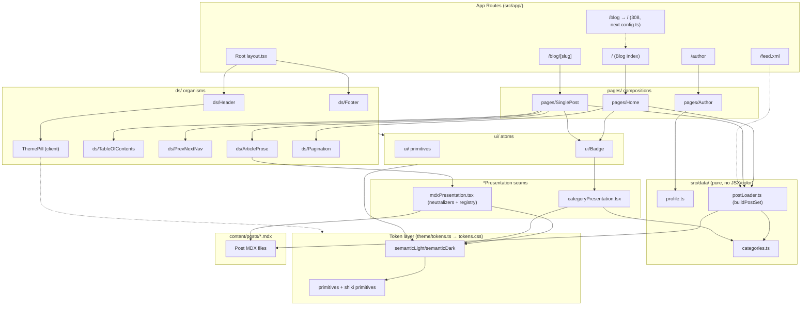

# Design - route-migration

> Owns the WHY: rationale, trade-offs, module boundaries, spec-scoped ADRs. Wire detail (FR blocks, `post-frontmatter` schema, scenarios) lives in [spec.md](spec.md) and is referenced by id, never restated. Repo-level decisions live in `docs/adr/` - ADR-0001 (MDX for Blog Posts) is referenced by id below, not duplicated.
>
> _Agents spawned: Software Architect only, per `config.yml agents.propose` override. Backend/UX/UI/AI agents not spawned (no backend/schema surface; the visual design is already fixed by the pack-1 Figma component library)._

## Architecture Overview

Post-migration module graph - dependency direction follows CLAUDE.md's `data → presentation seam → component` layering, with the token layer as the only color source.

No state diagram: no entity in scope carries a ≥3-state lifecycle (Posts are published-only per CONTEXT.md; theme is a 2-state toggle; validation outcomes are single-transition).

## Module Boundaries & Data Flow

- **Routes (`src/app/`)** compose `pages/` compositions and pass loader output down; they resolve nothing visual and re-validate nothing (single-gate rule, FR-2/FR-5).
- **`pages/` compositions** are typed against the real `Post`/`NavItem` models (pack-1 guarantee), so the fixture→loader swap is type-safe.
- **Presentation seams** own all data→visual resolution: `mdxPresentation.tsx` (MDX registry + trust neutralizers, ADR-RM-1), new `categoryPresentation.tsx` (category → `BadgeCategory` hue, ADR-RM-2). Components ask the seam, never map inside themselves.
- **`src/data/`** stays JSX/color-free: `categories.ts` (vocabulary, ADR-RM-2), `profile.ts` (extended for FR-6), `postLoader.ts` (pure-core validation of `post-frontmatter` incl. `coverImage` posture - allow-list, no existence check; see trade-offs).
- **Token layer** is the only color source after `theme.ts` dies: semantic aliases for components, ungrouped shiki primitives for code blocks (ADR-RM-3). Rules: `frontend/design-tokens.md`, CLAUDE.md token section.
- **Dependency direction:** `app → pages → ds → ui → semantic tokens → primitives`; seams sit beside `ds/` and bind data to semantic tokens. `architecture/general.md` (dependency direction, boundary placement) is the governing KB rule.

## Trade-off Analysis

### Migration sequencing - shiki re-home vs `theme.ts` deletion
- **Options:** (a) full-route passes with shiki re-homed first, `theme.ts`/`brand` deleted last; (b) big-bang commit combining last route migration + full legacy deletion.
- **Chosen:** (a) shiki re-homed first.
- **Gained:** pre-push gate (lint+type-check+vitest+audit) green at every intermediate commit; `shikiVars.test.ts` never points at a deleted file; FR-8 lands as an independently revertable commit.
- **Given up:** a temporary overlap window with two shiki color sources; requires discipline not to delete `theme.ts` prematurely. Big-bang was rejected: couples two failure domains, hard to bisect, violates D-8's per-task branch discipline.

### MDX component-mapping seam ownership
- **Options:** (a) keep registry in `mdxPresentation.tsx`, swap MUI `sx` for Tailwind tokens; (b) move mapping into `ds/ArticleProse` as a slot-based API.
- **Chosen:** (a) - see ADR-RM-1.
- **Gained:** the "single presentation seam" invariant holds; neutralizers stay co-located with the trust boundary (ADR-0001); security review remains a one-file audit.
- **Given up:** the seam file grows if `ArticleProse` later wants slot-level control. (b) was rejected: splits the trust boundary across two files and lets a `ds/` component make seam-like resolution decisions, violating the mandated layering.

### Category vocabulary placement (OQ-4)
- **Options:** (a) typed data module + presentation seam mapping to `BadgeCategory` hue; (b) free-form frontmatter strings with render-time derived hues.
- **Chosen:** (a) - see ADR-RM-2.
- **Gained:** compile-error safety via exhaustive `Record`; graceful warn+omit degradation; matches the `skillPresentation.tsx` precedent.
- **Given up:** one extra file to touch per new category - acceptable, matches existing seams. (b) rejected by OQ-4 itself: no compile-time safety, unstable colors, color logic outside a seam.

### coverImage validation posture
- **Options:** (a) allow-list validator in the loader pure core - must start with `/`, no `..` segments, no absolute/protocol-relative URLs; (b) additionally `stat` the file against `public/` at build time.
- **Chosen:** (a).
- **Gained:** the single validation gate stays pure and unit-testable; identical warn+drop posture to the slug gate; satisfies sec-coverimage-path-validated.
- **Given up:** a syntactically valid but non-existent path publishes and 404s at runtime - accepted as a known gap (Risk R-3); existence checking is a build-quality concern, not security, and would couple the pure core to fs I/O.

### Shiki palette re-home target
- **Options:** (a) `tokens.ts` primitives regenerated into `tokens.css`; (b) hand-authored `--shiki-*` block directly in `tokens.css`.
- **Chosen:** (a) - see ADR-RM-3.
- **Gained:** `tokens.css` stays `@generated`-only; the freshness-drift guard applies automatically; one generation path.
- **Given up:** the primitive layer gains deliberately non-theme-aliased names (shiki is a single dark-island set per OQ-2) - mitigated with a source comment so nobody forces a light variant into `semanticLight`. (b) rejected: violates "never hand-edit tokens.css" and would special-case the freshness test.

### IA-inversion redirect mechanism
- **Options:** (a) `next.config.ts` `redirects()` with `permanent: true`; (b) route-level `redirect('/')` in `src/app/blog/page.tsx`.
- **Chosen:** (a) - see ADR-RM-4.
- **Gained:** guaranteed 308 for a fully static route with zero runtime code; single auditable redirect table.
- **Given up:** less visible when browsing `src/app/`. (b) rejected: defaults to 307, ships a throwaway page component, easy to regress to non-permanent.

### Legacy-surface deletion strategy (D-6)
- **Options:** (a) incremental unwind gated by `brand` consumer count (navigation → root components → 3 presentation seams), final sweep for `theme.ts`/`layout.ts`/coexistence tooling/`package.json`; (b) migrate everything first, delete in one commit.
- **Chosen:** (a) - see ADR-RM-5.
- **Gained:** every intermediate commit keeps the gate green; bisectable; matches the explore finding that `brand` (~20 consumers) is deletable only after its consumers migrate.
- **Given up:** more commits to review; a shrinking-but-present `brand` seam for the pack's duration (Risk R-1). (b) rejected: dead-but-present seam invites accidental new consumers; one giant diff is hard to review/revert.

## Architecture Decision Records

_Spec-scoped (this pack only). Repo-level ADR-0001 referenced, not restated._

### ADR-RM-1: MDX presentation seam retains sole ownership of trust-boundary mapping

**Status:** Accepted

**Context:** Pack 2 rewrites `mdxPresentationBlock/Text` and `Callout` from MUI `sx` to token-bound Tailwind (FR-4). `ArticleProse` is currently a bare slot with no MDX-mapping equivalent. Design fork: the rewritten registry keeps populating `ArticleProse`'s children (seam stays authoritative), or the `<script>`/`<iframe>` neutralizers and component mapping move into `ArticleProse` as a richer DS organism. ADR-0001 and CLAUDE.md scope the load-bearing MDX trust boundary to "the single presentation seam."

**Decision:** `mdxPresentation.tsx` remains the single seam owning the MDXComponents registry, including the `<script>`/`<iframe>` neutralizers and the external-link `rel="noopener noreferrer"` rule. `ArticleProse` (ds/) stays a pure rendering slot - it accepts already-neutralized MDX output and applies no trust-relevant logic. `mdxPresentationBlock/Text` and `Callout` restyle in place without changing which file owns the mapping.

**Consequences:**
- A security reviewer auditing the MDX trust boundary reads exactly one file, unchanged in scope - satisfies sec-script-neutralized / sec-iframe-neutralized / sec-external-link-rel without re-deriving the boundary.
- `ArticleProse` stays simple and independently storyable with static fixture MDX (Storybook-first mandate).
- Future slot-level control extends `ArticleProse`'s props from the outside; the seam still decides content.
- References: ADR-0001, CLAUDE.md MDX trust boundary, FR-4.

### ADR-RM-2: Category vocabulary is a typed data module with a dedicated presentation seam

**Status:** Accepted

**Context:** FR-5/OQ-4 introduce optional `categories` frontmatter mapping to 8 `BadgeCategory` hues. CLAUDE.md forbids color resolution inside `src/data/*.ts` and mandates a presentation seam for data→visual mapping (precedent: `skillPresentation.tsx`'s exhaustive `Record<IconKey, …>`).

**Decision:** Introduce the vocabulary as a typed data module (`src/data/categories.ts`) exporting canonical category names as a union/const array - no colors, no JSX. Add a sibling seam (`categoryPresentation.tsx`) with an exhaustive `Record<CategoryName, BadgeCategory>` - a missing entry is a compile error. `buildPostSet`'s pure core validates frontmatter categories against the vocabulary; unknown entries → build warning + omission, the Post still publishes.

**Consequences:**
- Adding a category = one data-module edit + one exhaustive-Record entry - no parallel arrays (matches the `domains.ts` precedent).
- Card/Badge components ask the seam for a hue, never encode a category→color switch.
- The loader stays the single validation gate (FR-5); consumers re-validate nothing.
- References: OQ-4, FR-5, `post-frontmatter` data block.

### ADR-RM-3: Shiki palette re-homed as ungrouped tokens.ts primitives, not forced through semantic aliasing

**Status:** Accepted

**Context:** FR-8/D-9 require `--shiki-*` to leave `theme/theme.ts` `brand` before `theme.ts` deletion; `shikiVars.test.ts` guards drift; code blocks stay dark islands in both themes (OQ-2). `tokens.css` is `@generated` - hand-editing is forbidden. The primitive/semantic split assumes per-theme aliases, which shiki's single set does not need.

**Decision:** Add the shiki color set to `tokens.ts` as named primitives (not routed through `semanticLight`/`semanticDark` - intentionally no light variant this pack). Regenerate `tokens.css` via `npm run generate:tokens`. Repoint `shikiVars.test.ts` at the new primitive source; do not delete the test (D-9).

**Consequences:**
- The "never hand-edit, freshness-guarded" `tokens.css` invariant holds without exception.
- The primitive layer gains deliberately non-theme-aliased names - worth a one-line `tokens.ts` comment so a future reader doesn't force a light variant into `semanticLight`.
- A future light code theme modifies this primitive set and adds aliasing - not a rewrite of the re-home.
- References: FR-8, D-9, OQ-2; ADR-0001 documents shiki as originally "a second surface of the brand seam" - this ADR records its move off that seam.

### ADR-RM-4: `/blog` → `/` redirect implemented via `next.config.ts` `redirects()`

**Status:** Accepted

**Context:** FR-1/D-3 invert the IA: Blog index at `/`, `/blog` must permanently redirect (scenario expects 308). The site is fully SSG with no server runtime beyond Next.js routing.

**Decision:** Declare the redirect in `next.config.ts` via `redirects()` with `permanent: true` (emits 308), not a route-level `redirect()` call in `src/app/blog/page.tsx`.

**Consequences:**
- No throwaway `/blog` page component; RSS and `/blog/[slug]` untouched (rss-urls-unchanged).
- `next.config.ts` becomes the canonical audit point for site-level redirects.
- If `/blog` ever becomes a real route again (e.g. paginated archive), this ADR is superseded - a config redirect cannot host page logic.
- References: FR-1, D-3.

### ADR-RM-5: Legacy surface unwinds incrementally, gated by `brand` consumer count; final sweep deletes theme.ts/layout.ts/coexistence tooling

**Status:** Accepted

**Context:** D-6/D-8 require full MUI/Emotion deletion with full-route-per-pass migration and a pre-push gate green at every intermediate commit. `brand` has ~20 consumers; deletable only after navigation, root components, and 3 remaining presentation seams migrate off it.

**Decision:** Each route-migration pass removes that route's `brand`/MUI consumers on the same branch (D-8), driving the count to zero incrementally. `theme/theme.ts`, `theme/layout.ts`, coexistence fixtures/tests (`coexistence.spec.ts` minus its salvaged route-regression block, `cascade-tie.spec.ts`, `theme/coexistence.test.ts`, `CascadeTieFixtureCard`), and the `package.json` removals (six MUI/Emotion packages + `framer-motion` + Orbitron/Geist-sans) happen in one final sweep commit only after every route and the shiki palette (ADR-RM-3) have moved off `brand`.

**Consequences:**
- No window where `theme.ts` is deleted while a consumer still imports it - build and gate stay green.
- The final sweep is a mechanical, low-risk commit verified by mui-gone / deps-removed-pins-exact rather than a change that also has to get component migration right.
- The shrinking-but-present `brand` seam and orphan portfolio cluster remain a temptation for accidental new consumers mid-pack - Risk R-1/R-5.
- References: D-6, D-8, FR-9.

## Risk Flags

| # | Severity | Risk | Mitigation |
|---|----------|------|------------|
| R-1 | high | Mid-migration window: a late-migrated route accidentally reintroduces a `brand`/MUI import (copy-paste from an unmigrated sibling), stalling the final deletion sweep (ADR-RM-5). | After each route commit, grep `@mui/`, `@emotion/`, `theme.ts` imports and assert the consumer count only decreases; optionally a temporary CI check (removed in the final sweep) failing if `brand`'s count increases. |
| R-2 | high | FR-8 ordering (shiki re-home before `theme.ts` deletion) enforced only by PR discipline; out-of-order authoring breaks the pre-push gate after the deletion commit exists. | Land the re-home (ADR-RM-3) as its own commit strictly before the sweep; repoint `shikiVars.test.ts` at the tokens source from that commit onward so premature deletion fails CI immediately. |
| R-3 | medium | `coverImage` validation intentionally omits an existence check - a valid-looking but missing path publishes and 404s at runtime. | Accepted gap (pure-core scope discipline); optional later pack adds a non-blocking existence warning outside `buildPostSet`. |
| R-4 | medium | Category seam's exhaustive `Record` hardcodes the 8 `BadgeCategory` hues - a future design-system `BadgeCategory` change forces an edit here (compile error, safe but surprising, cross-pack dependency). | Note the dependency in a `categoryPresentation.tsx` header comment; the exhaustive `Record` already turns drift into a compile error. |
| R-5 | low | FR-9 deletion under-scoped if grep targets only `@mui/*` imports - dead data modules/presentation seams feeding the orphan portfolio cluster don't import MUI directly. | Treat the deletion list as reachability-from-`src/app/`-routes, not import grep alone; PRD scope already names the data modules + seams. |
| R-6 | low | Tailwind preflight re-enablement (OQ-1) changes global element baselines; enabling early could visually break not-yet-migrated routes/stories relying on the old reset. | Sequence preflight re-enablement as the last change with/just before the final legacy sweep (ADR-RM-5), after all routes are on the new family. |

## Knowledge-base rules applied

- `architecture/general.md` - dependency direction, boundary placement, single validation gate (loader pure core), never hand-edit generated artifacts (`tokens.css`, ADR-RM-3).
- `frontend/design-tokens.md` - primitive/semantic split, no literals in components (all trade-offs above).
- `frontend/components.md`, `frontend/styling.md` - seam/component state boundaries, Tailwind architecture for the MDX rewrite (FR-4).
- `frontend/accessibility.md` - preserved aria contracts (FR-3), ThemePill toggle semantics (FR-7).
- `languages/nextjs/app-router.md`, `server-vs-client.md`, `anti-patterns.md` - config-level redirect (ADR-RM-4), client boundary confined to `ThemePill`/next-themes provider (FR-7), SSG preserved (FR-1/FR-2).
- `languages/typescript/patterns.md` - exhaustive `Record` unions for the category seam (ADR-RM-2), static data placement.
- `security/input-validation.md` - `coverImage`/`categories` boundary validation posture (FR-5).
- `security/deps-and-config.md` - package-manager-driven removal, exact pins, no hand-edited lockfile (FR-9).
