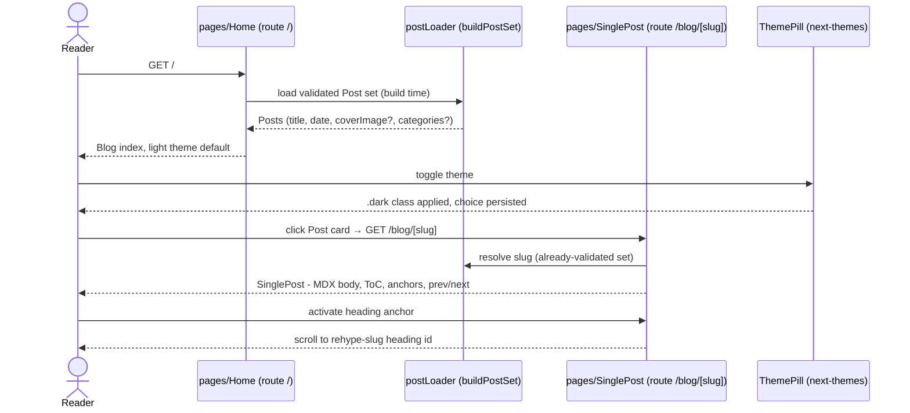

# Spec - route-migration

> Pack 2 of the MUI → shadcn re-platform: wire the pack-1 design system (`pages/{Home,SinglePost,Author}`) into the live App Router routes, port the reading features the Figma frames lack, and delete the entire MUI/Emotion legacy surface.
>
> _Note: Security Engineer agent not spawned - spec config (`config.yml agents.propose`) overrides the propose agent set to `engineering/software-architect` only. Security scenarios below are derived from the CLAUDE.md MDX trust boundary, ADR-0001, and KB security rules (`security/input-validation.md`, `security/deps-and-config.md`)._

## Overview

The design system delivered by pack 1 (`specs/design-system/`) exists only in Storybook; every live route still renders the old MUI 7 + Emotion dark surface. This feature migrates all routes to the new component family in full-route passes (PRD D-8), inverts the IA so the Blog index serves at `/` (D-3), adds a data-driven `/author` route (D-4), extends the **Post** model with optional `coverImage` + `categories` frontmatter (D-2), rewrites the MDX presentation seam onto semantic tokens with the trust-boundary neutralizers preserved verbatim (D-7), and then deletes the legacy surface and its six MUI/Emotion packages plus `framer-motion` and legacy-only fonts (D-6).

Terms follow `CONTEXT.md`: **Post**, **Blog** as defined there. No API endpoints change (RSS is URL-neutral); no database exists. The only data-shape change is Post MDX frontmatter.

### Decisions resolving the PRD's open questions

| # | Question | Decision |
|---|----------|----------|
| OQ-1 | Tailwind preflight | **Re-enable preflight** once MUI `CssBaseline` is gone; delete the hand-rolled `@layer base` reset and `@layer mui` from `globals.css` (the ADR-DS-2 rationale inverts with MUI's removal). |
| OQ-2 | Shiki in light mode | **Code blocks stay dark islands** in both themes (common blog pattern; matches Figma code-block frame). One `--shiki-*` value set, re-homed to the token layer (FR-8); no `.dark`-keyed variant this pack. |
| OQ-3 | Mono font | **Keep the `--font-geist-mono` next/font variable** as-is. No font token layer this pack; only Orbitron and Geist *sans* are dropped. |
| OQ-4 | Category vocabulary | **Mapping is data, not free-form frontmatter.** A category vocabulary lives in `src/data/` (category name → `BadgeCategory` hue resolved in a presentation seam). The loader validates each frontmatter category against the vocabulary: unknown → build warning + category omitted (Post still publishes). |
| OQ-5 | e2e color assertions | **Restate as token-resolution assertions**: assert the computed style equals the resolved semantic-token CSS variable, never a hardcoded rgb literal - survives future palette edits. |
| OQ-6 | Pagination | **Presentational until post count demands it.** `Pagination` does not render when total pages ≤ 1; no `?page=` routing this pack. |

## Functional Requirements

### FR-1: Blog index serves at `/`
A reader visiting the site root gets the Figma **Blog** index (`pages/Home`) rendering real **Posts** from the loader, newest first. The old `/`→`/blog` redirect inverts: `/blog` permanently redirects to `/`; Post URLs and the RSS feed are unchanged.

**Scenarios:** home-index-renders, blog-redirects-home, rss-urls-unchanged, pagination-hidden-single-page

### FR-2: Post page renders the design-system SinglePost
A reader visiting `/blog/[slug]` gets `pages/SinglePost` composed with the real Post loaded through the existing single-slug-gate MDX pipeline. Static generation (SSG) is preserved; unknown slugs still 404.

**Data:** `post-frontmatter`
**Scenarios:** post-page-renders, unknown-slug-404

### FR-3: Reading features preserved as storied `ds/` components
Every reading affordance the live blog has today - Table of Contents, prev/next Post navigation, heading anchor links - is rebuilt as new `ds/` components on semantic tokens, Storybook-first per CLAUDE.md, with the existing e2e accessibility contracts (aria names, `#mobile-menu`, rehype-slug heading ids) intact.

**Scenarios:** toc-contract-preserved, prevnext-navigation, heading-anchors-preserved

### FR-4: MDX presentation seam rewritten on tokens
The MDX body presentation (`mdxPresentationBlock/Text`, `Callout`) moves from MUI `sx` to token-bound Tailwind at the single presentation seam. The trust-boundary neutralizers (`<script>`/`<iframe>` no-render, external-link `rel`) survive verbatim per ADR-0001 and CLAUDE.md.

**Scenarios:** mdx-body-token-styled, code-block-highlighted

### FR-5: Post model gains optional coverImage + categories
A Post may declare `coverImage` and `categories` in MDX frontmatter, validated in the loader's pure core. Cards and the Post page degrade gracefully when either is absent - no placeholder stand-ins in production.

**Data:** `post-frontmatter`
**Scenarios:** cover-categories-render, cover-categories-absent, unknown-category-omitted

### FR-6: `/author` route, data-driven
A reader visiting `/author` gets `pages/Author` with identity sourced from `src/data/profile.ts` (extending that module if fields are missing) instead of the current hardcode. The Header nav gains an Author link.

**Scenarios:** author-page-renders, author-nav-link

### FR-7: Root layout chrome replaced, theme toggle live
The root layout composes `ds/Header` + `ds/Footer`; `ThemeProvider` reduces to next-themes only; `ThemePill` wires to `setTheme` with **light** as default and dark fully token-backed. The choice persists across visits.

**Scenarios:** layout-chrome-replaced, theme-toggle-works, light-default

### FR-8: Shiki palette re-homed before theme.ts dies
The `--shiki-*` CSS-variable palette moves out of `theme/theme.ts` `brand` into the token layer so build-time code highlighting and its pre-push gate (`shikiVars.test.ts`, repointed not deleted) survive the legacy theme's deletion.

**Scenarios:** code-block-highlighted, shiki-gate-green

### FR-9: Legacy surface fully deleted
All MUI root components (including the dead portfolio cluster and their data modules + presentation seams), `navigation/*`, `theme/theme.ts` + `theme/layout.ts`, coexistence fixtures/tests, and the six MUI/Emotion packages plus `framer-motion`, Orbitron, and Geist sans are removed. The build, unit tests, and chromium e2e stay green with exact-pinned remaining deps.

**Scenarios:** mui-gone, deps-removed-pins-exact, preflight-reenabled

### FR-10: Test surfaces and docs updated
Unit + chromium e2e suites are updated for the new surface (color assertions restated per OQ-5; obsolete coexistence suites deleted, the route-regression block of `coexistence.spec.ts` salvaged); CLAUDE.md coexistence notes and CONTEXT.md (if touched) are brought current.

**Scenarios:** e2e-token-assertions, docs-current

## Data Model

### `post-frontmatter`
MDX frontmatter of files under `content/posts/` - the Post collection's schema (no database exists). Parsed and validated in `buildPostSet` (`src/data/postLoader.ts`), the single validation gate.

**FRs:** FR-2, FR-5

| Field | Type | Required | Notes |
|-------|------|----------|-------|
| title | string | yes | existing |
| date | ISO date string | yes | existing |
| dek | string | yes | existing |
| coverImage | string | no | **new** - site-relative path (`/…`) to a static asset under `public/`; non-conforming value → build warning + field dropped |
| categories | string[] | no | **new** - each entry must match the category vocabulary (`src/data/`); unknown entry → build warning + entry omitted, Post still publishes |

**Constraints**
- Slug gate unchanged: filename must match `^[a-z0-9-]+$` or the candidate is skipped with a build warning (never joined to the filesystem).
- `coverImage` must not be an external URL and must not contain `..` path segments - same trust posture as the slug gate.
- Validation lives only in the loader's pure core; consumers (`generateStaticParams`, components) re-validate nothing.

## Scenarios

### home-index-renders
- **Given** published Posts exist under `content/posts/`
- **When** a reader visits `/`
- **Then** the `pages/Home` composition renders with real Post cards (title, date, dek from the loader), newest first, in the light theme by default

### blog-redirects-home
- **Given** the site is built
- **When** a reader requests `/blog`
- **Then** they receive a permanent redirect (308) to `/`

### rss-urls-unchanged
- **Given** the site is built
- **When** `/feed.xml` is fetched
- **Then** every item URL still points at `/blog/[slug]` exactly as before the migration

### pagination-hidden-single-page
- **Given** the published Post count fits on one index page
- **When** a reader visits `/`
- **Then** the `Pagination` organism does not render

### post-page-renders
- **Given** a Post with slug `s` exists
- **When** a reader visits `/blog/s`
- **Then** `pages/SinglePost` renders with the Post's metadata and MDX body, statically generated

### unknown-slug-404
- **Given** no Post with slug `nope` exists
- **When** a reader visits `/blog/nope`
- **Then** the response is a 404 page

### toc-contract-preserved
- **Given** a Post whose body has headings
- **When** the Post page renders
- **Then** a Table of Contents with the same accessible name as today lists the headings, and each entry links to a rehype-slug-generated heading id

### prevnext-navigation
- **Given** at least two published Posts
- **When** a reader views a Post that has a chronological neighbor
- **Then** prev/next navigation renders linking to the neighboring Post(s), styled on semantic tokens

### heading-anchors-preserved
- **Given** a rendered Post body heading
- **When** a reader activates its anchor link
- **Then** the URL fragment matches the heading's rehype-slug id and the page scrolls to it

### mdx-body-token-styled
- **Given** a Post body with paragraphs, lists, blockquotes, and a Callout
- **When** the Post page renders
- **Then** every element's colors/spacing resolve from semantic-token utilities - no MUI `sx`, no hex/rgb literals

### code-block-highlighted
- **Given** a Post body with a fenced code block
- **When** the site is built
- **Then** shiki emits static highlighted HTML whose colors resolve from `--shiki-*` variables sourced from the token layer, rendered as a dark island in both themes

### shiki-gate-green
- **Given** `theme/theme.ts` is deleted
- **When** the pre-push gate runs
- **Then** the repointed `shikiVars.test.ts` passes against the token-layer source

### cover-categories-render
- **Given** a Post with valid `coverImage` and known `categories` frontmatter
- **When** the index and Post pages render
- **Then** the cover image displays and each category renders as a Badge with its vocabulary-mapped hue

### cover-categories-absent
- **Given** a Post with neither `coverImage` nor `categories`
- **When** cards and the Post page render
- **Then** layouts degrade gracefully - no broken image, no placeholder stand-in, no empty badge row

### unknown-category-omitted
- **Given** a Post whose frontmatter lists a category not in the vocabulary
- **When** the site builds
- **Then** a build warning names the offending entry, the entry is omitted, and the Post still publishes

### author-page-renders
- **Given** `src/data/profile.ts` holds the owner's identity
- **When** a reader visits `/author`
- **Then** `pages/Author` renders with name and title from the profile module - no hardcoded identity

### author-nav-link
- **Given** any page
- **When** the Header renders
- **Then** the nav (desktop and `#mobile-menu`) includes a link to `/author`

### layout-chrome-replaced
- **Given** any route
- **When** the page renders
- **Then** `ds/Header` and `ds/Footer` frame the content and no MUI/Emotion provider is mounted

### theme-toggle-works
- **Given** a reader on any page
- **When** they activate the `ThemePill`
- **Then** the theme flips between light and dark (`.dark` class mechanism), and the choice persists on reload

### light-default
- **Given** a first-time visitor with no stored preference
- **When** any page renders
- **Then** the light theme is active

### mui-gone
- **Given** the migration is complete
- **When** searching the source tree and `package.json`
- **Then** no `@mui/*`, `@emotion/*`, or `framer-motion` import or dependency remains, and `npm run build` succeeds

### deps-removed-pins-exact
- **Given** dependencies were removed from `package.json`
- **When** the `depsPinned.test.ts` suites run (`src/components/ui/depsPinned.test.ts`, `src/storybook-tooling/depsPinned.test.ts` - both run in the pre-push gate)
- **Then** all remaining dependencies are exact-pinned and the lockfile is consistent

### preflight-reenabled
- **Given** MUI `CssBaseline` is gone
- **When** the Tailwind build runs
- **Then** preflight is enabled and the hand-rolled `@layer base` reset and `@layer mui` are absent from `globals.css`

### e2e-token-assertions
- **Given** the updated e2e suite
- **When** color-related assertions run
- **Then** they compare computed styles against resolved semantic-token variables, with no hardcoded rgb literals from the MUI era

### docs-current
- **Given** the migration is complete
- **When** reading CLAUDE.md and CONTEXT.md
- **Then** no coexistence-era guidance (e.g. `@layer mui`, `brand` seam for MUI surface) remains that contradicts the shipped state

## Security Scenarios

_The MDX trust boundary (CLAUDE.md, ADR-0001) is load-bearing: Posts are 100% owner-authored. The seam rewrite and loader extension must not weaken it. STRIDE focus: Tampering (rendered content), Elevation of Privilege (active content in bodies), plus supply-chain hygiene for the dependency removal._

### sec-script-neutralized
- **Given** a Post body containing a `<script>` element
- **When** the Post page renders through the rewritten seam
- **Then** the script is mapped to the no-render neutralizer and no script executes (mitigates EoP via active content)

### sec-iframe-neutralized
- **Given** a Post body containing an `<iframe>` element
- **When** the Post page renders
- **Then** the iframe is neutralized and no third-party document loads

### sec-external-link-rel
- **Given** a Post body with an external link
- **When** the link renders
- **Then** it carries `rel="noopener noreferrer"` (mitigates reverse-tabnabbing)

### sec-slug-gate-unchanged
- **Given** a file under `content/posts/` whose name violates `^[a-z0-9-]+$`
- **When** the site builds
- **Then** the candidate is skipped with a build warning and no filesystem path is derived from it (single validation gate, unchanged)

### sec-coverimage-path-validated
- **Given** a Post frontmatter `coverImage` of an external URL or a value containing `..`
- **When** the loader validates frontmatter
- **Then** the value is rejected with a build warning and the field is dropped - no external fetch, no path traversal into `public/` siblings (input validation at the boundary, `security/input-validation.md`)

### sec-dep-removal-clean
- **Given** the six MUI/Emotion packages and `framer-motion` are removed
- **When** the lockfile is regenerated
- **Then** removal happens via the package manager (no hand-edited lockfile), remaining pins stay exact, and `npm audit` (pre-push) passes (`security/deps-and-config.md`)

## User Flow

